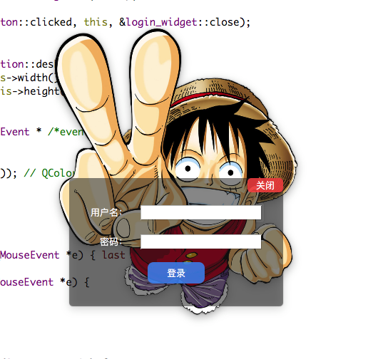

# qt_login

Qt创建的界面默认都是包含标题栏的矩形框，这在实际项目开发中，自定义一些比较美观的界面中会显得比较单一，自定义的不规则界面效果如下：



实际上不规则中的界面只是将底层透明化，只显示底层上面的子部件而已。


设置底层透明只需要在窗口的构造函数中调用：

```c++
  this->setAttribute(Qt::WA_TranslucentBackground, true);
```

隐藏标题栏：

```c++
this->setWindowFlags(Qt::FramelessWindowHint);
```

去除标题栏后恢鼠标按住移动窗口功能需要重载鼠标事件的三个函数：

```c++
// login_window.h
protected:
  void mousePressEvent(QMouseEvent *e);
  void mouseMoveEvent(QMouseEvent *e);
  void mouseReleaseEvent(QMouseEvent *e);
private:
  QPoint last; // 鼠标位置坐标

```

```c++
// login_window.cpp
void login_widget::mousePressEvent(QMouseEvent *e) { last = e->globalPos(); }

void login_widget::mouseMoveEvent(QMouseEvent *e) {
  int dx = e->globalX() - last.x();
  int dy = e->globalY() - last.y();
  last = e->globalPos();
  move(x() + dx, y() + dy);
}
void login_widget::mouseReleaseEvent(QMouseEvent *e) {
  int dx = e->globalX() - last.x();
  int dy = e->globalY() - last.y();
  move(x() + dx, y() + dy);
}

```

